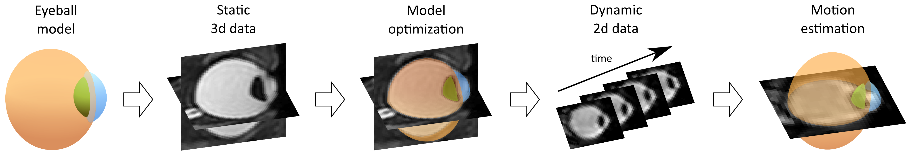
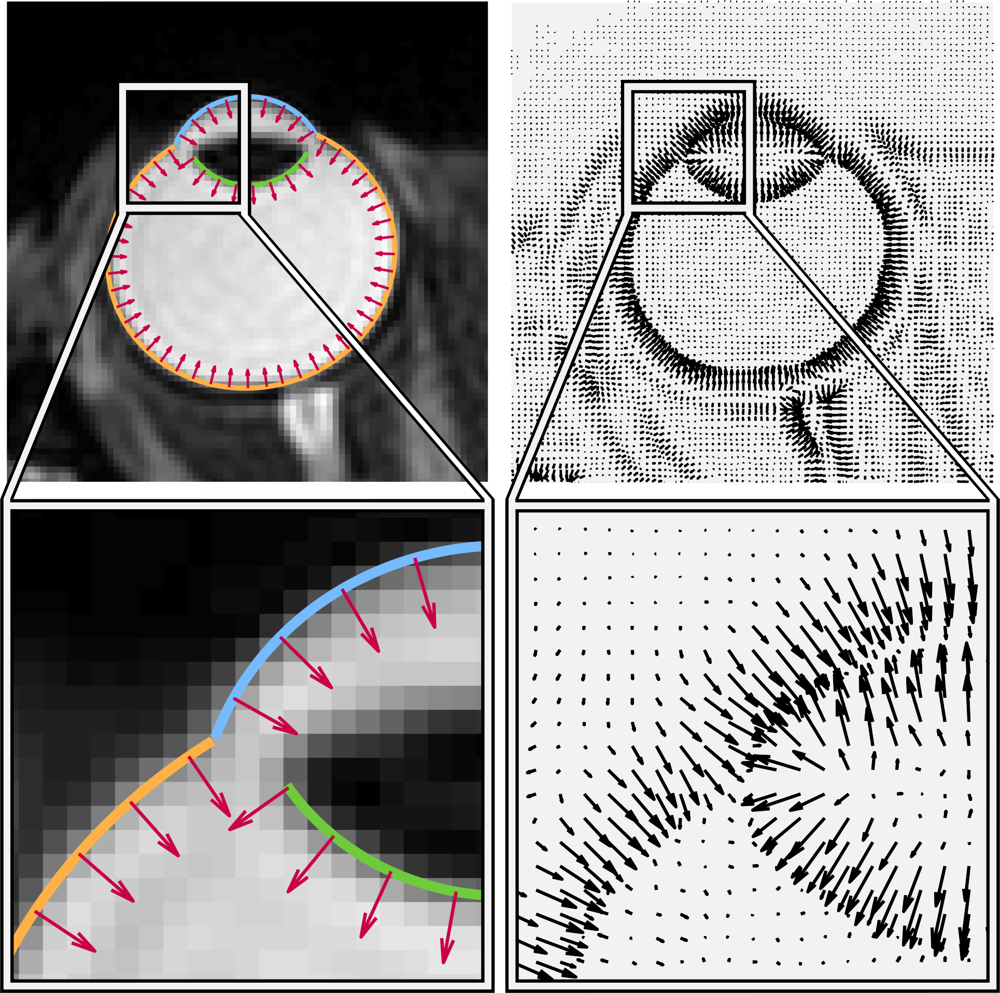

# MREyeTrack
MREyeTrack is a fully automated segmentation algorithm to analyse eye kinematics from high-speed MRI data. It optimises 
motion estimation by obtaining precise knowledge of the geometric shape of the eyeball first, before undertaking kinematic 
estimation. The eyeball is modelled as a combination of ellipsoids representing sclera, cornea and the inner part of the 
lens. This model if then fitted to 3D, high-resolution, MRI scan data for each individual participant using our novel 
Normal Gradient Matching algorithm. 

In Normal Gradient Matching, the best fit is determined by matching the normal vectors of the ellipsoids to the image 
gradients of the MRI data. Eye motion data in terms of translation and rotation of the 3D eye model can then be
estimated by finding the optimal projection of the 3D model to the 2D slice image plane using Normal Gradient Matching.

  

For more detail, see our recent publication [*Kirchner, Watson & Lappe - Real-time MRI reveals unique insight into the 
full kinematics of eye movements (2021)*](https://www.eneuro.org/content/9/1/ENEURO.0357-21.2021). Here we provide a demo 
of high-speed MRI data of one participant looking back and forth between two targets (left) and blinking (right).

Saccades                   |  Blinking
:-------------------------:|:-------------------------:
       |  

## Demo Dataset
This demo dataset consists of the following three exemplary MR scans of the same participant:
* T2_weighted_3D_scan.mat
* bSSFP_Saccade_Axial.mat
* bSSFP_Slow_Blink_Sagittal.mat
 
The first is a static, 3D, T2-weighted scan which was obtained while the participant was fixating a target dot at central position between the eyes. The second is a dynamic, 2D, bSSFP scan in the axial plane with a temporal resolution of 35ms while the participant performed fast eye movements (saccades) between targets at -7° and 7°. The third is also a bSSFP scan, this time in the sagittal plane with a temporal resolution of 38ms, while the participant blinked every 3 seconds.

## Requirements
You need to have installed MATLAB version 2019a (might work with earlier versions, but was developed in 2019a), as well as the Global Opimization Toolbox and the Image Processing Toolbox.

## Instructions
1) Download the full repository and put it in your local Matlab folder.
2) Run *mreyetrack_3D* to optimise the 3D eyeball model based on the T2-weighted scan. *mreyetrack_3D* is a wrapper script for the preprocessing & segmentation of the data that allows you to set a few model parameters. Results are plotted automatically after segmentation. On a MacBook, *mreyetrack_3D* takes around 10 minutes to run for one participant.
3) Run *mreyetrack_2D* to estimate eye motion in the dynamic bSSFP scan. *mreyetrack_2D* is a wrapper script for the preprocessing & segmentation of the data that allows you to set a few parameters and choose the bSSFP sequence (in this demo you can choose between bSSFP_Saccade_Axial and bSSFP_Slow_Blink_Sagittal). Results of segmentation and eye motion are plotted automatically after the analysis is complete. On a MacBook, *mreyetrack_2D* takes around 0.6 seconds per eye each image, which amounts to ~15 minutes for the sagittal and ~30 minutes for the axial sequence.
