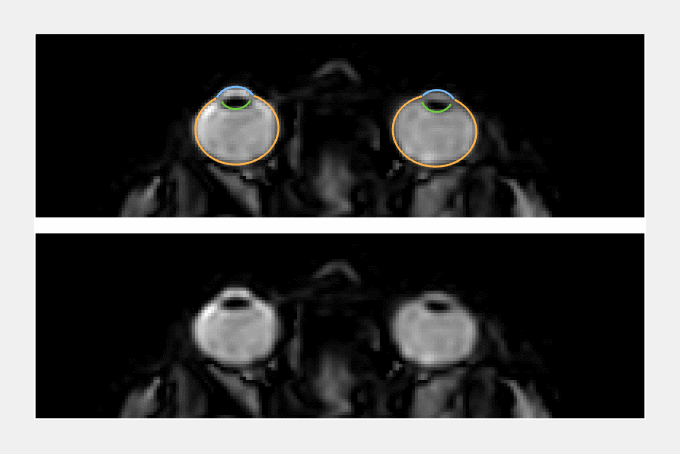

# MREyeTrack
MREyeTrack is a fully automated framework to analyse eye kinematics in MR data, as described in *link_to_upcoming_publication*.

## Demo Dataset
This demo dataset consists of the following three exemplary MR scans of the same participant:
* T2_weighted_3D_scan.mat
* bSSFP_Saccade_Axial.mat
* bSSFP_Slow_Blink.mat
 
The first is a static, 3D, T2-weighted scan which was obtained while the participant was fixating a target dot at central position between the eyes. The second is a dynamic, 2D, bSSFP scan in the axial plane with a temporal resolution of 35ms while the participant performed fast eye movements (saccades) between targets at -7° and 7°. The third is also a bSSFP scan, this time in the sagittal plane with a temporal resolution of 38ms, while the particpant blinked every 3 seconds.

## Requirements
You need to have installed MATLAB version R2019a with the Global Opimization and Signal Processing Toolbox.

## Instructions
1) Download the full repository and place in your local matlab folder.
2) Run *mreyetrack_3D* to optimise the 3D eyeball model based on the T2-weighted scan.
3) Run *mreyetrack_2D* to estimate eye motion of the bSSFP scan. 
